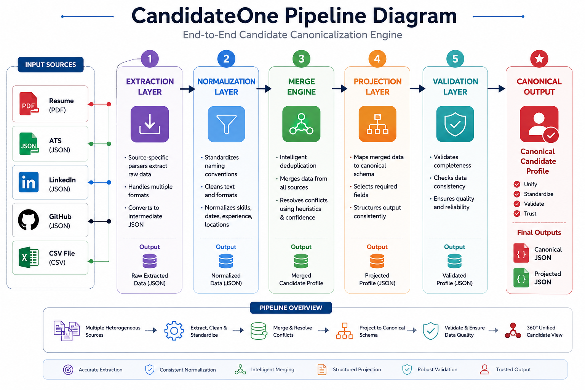
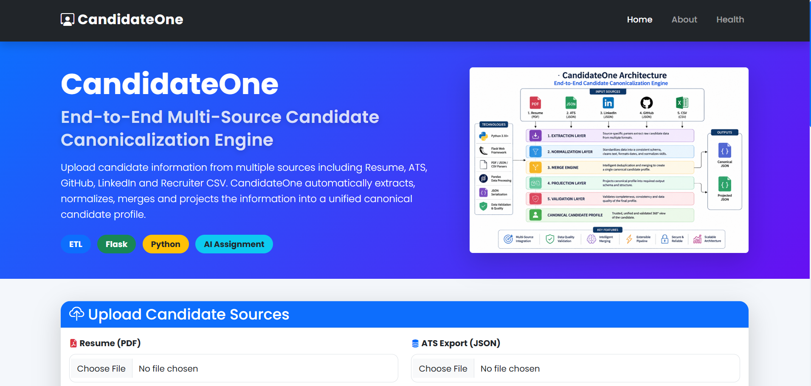
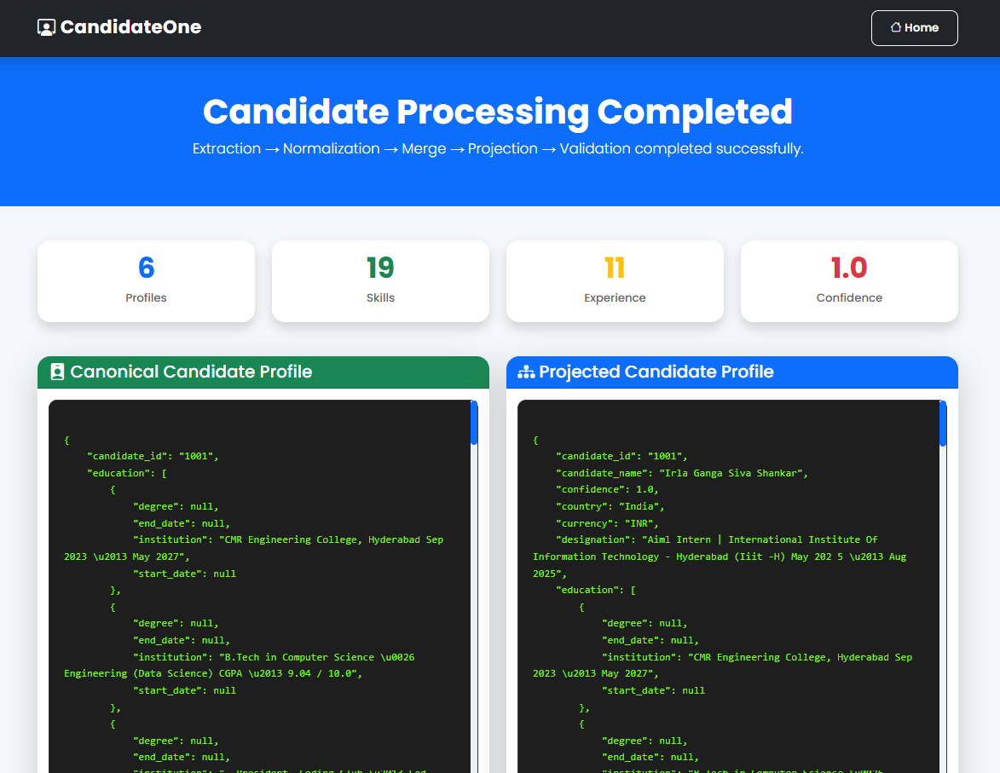

<div align="center">

# 🚀 CandidateOne

### End-to-End Multi-Source Candidate Canonicalization Engine

<p>

Transform fragmented candidate information from multiple sources into a single,
validated, configurable, confidence-scored canonical profile.

</p>

<br>


<br><br>


</div>

---

# 📌 Overview

CandidateOne is an end-to-end **ETL pipeline** that consolidates candidate information collected from multiple structured and unstructured sources into a single canonical profile.

Instead of treating resumes, ATS exports, LinkedIn profiles, GitHub profiles, and recruiter spreadsheets independently, CandidateOne intelligently extracts, normalizes, validates, merges, and projects the information into one trusted representation.

This project was designed as a solution to the **Eightfold AI Candidate Canonicalization Engineering Challenge**, focusing on software engineering principles, modular architecture, deterministic processing, explainability, and configurable output generation.

---

# 🎯 Problem Statement

Modern hiring platforms receive candidate information from multiple systems.

For a single candidate, different sources may contain:

- Different names
- Different phone numbers
- Missing emails
- Different skill spellings
- Partial education
- Duplicate experience
- Conflicting information

Without a canonical representation:

- Duplicate candidates appear.
- Recruiters waste time.
- Downstream AI systems consume inconsistent data.
- Analytics become unreliable.

CandidateOne solves this problem through a deterministic ETL pipeline.

---

# 💡 Solution

CandidateOne processes candidate information through five major stages.

```text
Resume (PDF)
ATS Export (JSON)
LinkedIn (JSON)
GitHub (JSON)
Recruiter CSV
        │
        ▼
Extraction Layer
        │
        ▼
Normalization Layer
        │
        ▼
Merge Engine
        │
        ▼
Projection Layer
        │
        ▼
Validation Layer
        │
        ▼
Canonical Candidate Profile
```

Every field in the final output is:

- Extracted
- Normalized
- Validated
- Traceable to its source
- Assigned a confidence score

---

# ⭐ Key Highlights

✅ Multi-source candidate ingestion

✅ Resume PDF parser

✅ ATS JSON parser

✅ LinkedIn JSON parser

✅ GitHub JSON parser

✅ Recruiter CSV parser

✅ Modular ETL architecture

✅ Configurable projection layer

✅ Canonical JSON generation

✅ Confidence scoring

✅ Provenance tracking

✅ Schema validation

✅ Downloadable output

✅ Responsive Flask web application

---

# 🏗️ System Architecture

<p align="center">


</p>

The system is composed of independent modules that communicate through a fixed canonical schema.

This design allows new data sources to be integrated with minimal changes to the pipeline while preserving deterministic behavior.

---

# 🔄 End-to-End Pipeline

<p align="center">



</p>

The pipeline performs:

1. Extraction
2. Normalization
3. Merge
4. Projection
5. Validation

before generating the final canonical candidate profile.

---

# 📂 Repository Structure

```text
CandidateOne/

├── app.py
├── pipeline.py
├── config/
├── docs/
├── extractors/
├── merger/
├── models/
├── normalizer/
├── projection/
├── validator/
├── utils/
├── templates/
├── static/
├── tests/
├── sample_input/
├── output/
└── README.md
```
# ⚙️ Technology Stack

| Category | Technologies |
|----------|--------------|
| Language | Python 3.13 |
| Backend | Flask |
| Data Processing | Pandas |
| PDF Parsing | PyPDF2 |
| Validation | JSON Schema |
| Phone Normalization | phonenumbers |
| Email Validation | email-validator |
| Country Standardization | pycountry |
| Frontend | HTML5, CSS3, Bootstrap 5, JavaScript |
| Architecture | Modular ETL Pipeline |

---

# 🏛️ Software Architecture

CandidateOne follows a layered ETL architecture where each component has a single responsibility.

```text
                    INPUT SOURCES

 Resume     ATS     LinkedIn     GitHub     Recruiter CSV
    │         │         │            │             │
    └─────────┴─────────┴────────────┴─────────────┘
                          │
                    Extraction Layer
                          │
                    Normalization Layer
                          │
                     Merge Engine
                          │
              Confidence & Provenance
                          │
                    Projection Layer
                          │
                    Schema Validator
                          │
                   Canonical JSON Output
```

Each layer is completely isolated, making the pipeline easy to extend, test and maintain.

---

# 🧩 ETL Pipeline

## ① Extraction Layer

Supported Sources

| Source | Type |
|---------|------|
| Resume | PDF |
| ATS | JSON |
| LinkedIn | JSON |
| GitHub | JSON |
| Recruiter Export | CSV |

Each extractor converts its source into a common canonical structure before entering the pipeline.

Example:

```python
Resume
        │
        ▼
ResumeReader
        │
        ▼
Canonical Candidate
```

---

## ② Normalization Layer

Raw data from different systems often contains inconsistencies.

Example

Before

```text
Python3
python
Python Programming
PYTHON
```

After

```text
Python
```

Normalization includes:

- Email validation
- Phone formatting (E.164)
- Country normalization (ISO-3166)
- Date normalization
- Skill canonicalization
- Location cleanup

---

## ③ Merge Engine

The Merge Engine combines all candidate sources into a single trusted profile.

Instead of blindly overwriting fields, CandidateOne resolves conflicts intelligently.

Merge Strategy

```
Resume
      │
ATS
      │
LinkedIn
      │
GitHub
      │
CSV
      │
      ▼

Conflict Resolver

      ▼

Single Candidate Profile
```

Merge priorities are determined using configurable source reliability.

Default order

```
Resume
↓

LinkedIn
↓

ATS
↓

GitHub
↓

Recruiter CSV
```

---

# 🎯 Conflict Resolution Strategy

Different sources often disagree.

Example

Resume

```
Phone
+91 90103xxxxx
```

LinkedIn

```
Phone
Not Available
```

Final Decision

```
+91 90103xxxxx
```

Rules

✔ Prefer non-empty values

✔ Prefer trusted sources

✔ Preserve provenance

✔ Never invent information

✔ Deterministic results

---

# 📚 Canonical Schema

Every extractor produces the same internal schema.

```json
{
  "candidate_id": "",
  "full_name": "",
  "emails": [],
  "phones": [],
  "location": {},
  "links": {},
  "headline": "",
  "years_experience": 0,
  "skills": [],
  "experience": [],
  "education": [],
  "provenance": {},
  "overall_confidence": 0.0
}
```

Because every module shares this schema, downstream components never need to know the original source format.

---

# 🎯 Projection Layer

The Projection Layer separates internal storage from external output.

Instead of changing the canonical schema, users can reshape the output using configuration.

Example configuration

```json
{
  "fields":[
    {
      "path":"full_name",
      "type":"string"
    },
    {
      "path":"phones",
      "normalize":"E164"
    }
  ]
}
```

Possible operations

- Include selected fields
- Rename fields
- Normalize output
- Hide provenance
- Hide confidence
- Handle missing values

This keeps the internal pipeline independent from downstream integrations.

---

# ✅ Schema Validation

Before returning any output, CandidateOne validates the generated profile.

Validation checks

- Required fields
- Correct data types
- Array structure
- Object structure
- Confidence score
- Canonical schema compliance

Only valid candidate profiles are returned.

---

# 📈 Confidence Scoring

Every candidate receives an overall confidence score.

Confidence combines

```
Source Reliability
        +
Profile Completeness
        +
Validation Success
```

Default source weights

| Source | Weight |
|----------|--------|
| Resume | 0.30 |
| LinkedIn | 0.25 |
| ATS | 0.20 |
| GitHub | 0.15 |
| Recruiter CSV | 0.10 |

This score helps downstream systems determine profile reliability.

# 🚀 Getting Started

## Prerequisites

Before running CandidateOne, ensure the following are installed.

| Requirement | Version |
|-------------|----------|
| Python | 3.10+ |
| pip | Latest |
| Git | Latest |

---

# 📦 Installation

Clone the repository

```bash
git clone https://github.com/<your-username>/CandidateOne.git
```

Move into the project

```bash
cd CandidateOne
```

Create virtual environment

```bash
python -m venv venv
```

Activate virtual environment

### Windows

```bash
venv\Scripts\activate
```

### Linux / macOS

```bash
source venv/bin/activate
```

Install dependencies

```bash
pip install -r requirements.txt
```

---

# ▶ Running the Application

Start the Flask application

```bash
python app.py
```

Open your browser

```
http://127.0.0.1:5000
```

---

# 📁 Sample Input

CandidateOne supports both structured and unstructured sources.

| Source | Format |
|---------|--------|
| Resume | PDF |
| ATS Export | JSON |
| LinkedIn | JSON |
| GitHub | JSON |
| Recruiter Export | CSV |

Example

```
sample_input/

resume.pdf

ats.json

linkedin.json

github.json

recruiter.csv
```

---

# 🖥️ Application Demo

### Home Page

<p align="center">



</p>

---

### Upload Sources

Upload

✅ Resume

✅ ATS

✅ LinkedIn

✅ GitHub

✅ Recruiter CSV

Click

```
Run CandidateOne Pipeline
```

---

### Generated Output

<p align="center">



</p>

The pipeline produces

✔ Canonical Candidate Profile

✔ Projected Candidate Profile

✔ Confidence Score

✔ Provenance Information

✔ Downloadable JSON

---

# 📤 Output

Default output

```json
{
  "candidate_id":"1001",
  "full_name":"Irla Ganga Siva Shankar",
  "emails":[
      "238r1a6786@gmail.com"
  ],
  "phones":[
      "+919010376352"
  ],
  "skills":[
      "Python",
      "Flask",
      "Machine Learning"
  ]
}
```

Projected output

```json
{
  "candidate_name":"Irla Ganga Siva Shankar",
  "primary_email":"238r1a6786@gmail.com",
  "phone":"+919010376352"
}
```

---

# 🧪 Testing

Run all tests

```bash
pytest
```

Run specific tests

```bash
pytest tests/
```

---

# ⚡ Performance

Current implementation

| Metric | Value |
|---------|--------|
| Sources Supported | 5 |
| Extractors | 5 |
| Normalizers | 5 |
| Merge Engine | ✓ |
| Projection Layer | ✓ |
| Validation | ✓ |
| Confidence Engine | ✓ |
| Provenance Tracking | ✓ |

Designed for deterministic processing of thousands of candidate records.

---

# 🛡 Edge Cases Handled

CandidateOne gracefully handles

✅ Missing email

✅ Missing phone

✅ Empty skills

✅ Duplicate skills

✅ Duplicate candidate sources

✅ Invalid dates

✅ Invalid phone numbers

✅ Invalid emails

✅ Missing education

✅ Missing experience

✅ Empty recruiter rows

✅ Unknown JSON fields

✅ Null values

✅ Partial candidate profiles

Instead of crashing, the pipeline validates and safely returns a consistent canonical profile whenever possible.

---

# 🎯 Why This Design?

The architecture follows a modular ETL pattern.

Advantages

- Independent extractors
- Pluggable data sources
- Configurable output schema
- Deterministic merge logic
- Explainable confidence calculation
- Clear provenance tracking
- Easy maintenance
- Easy testing
- Scalable architecture

Every component has a single responsibility, making the system extensible without affecting the rest of the pipeline.

---

# 📈 Future Improvements

Planned enhancements

- OCR support for scanned resumes
- DOCX resume extraction
- Multi-language resume parsing
- AI-powered skill extraction
- LLM-assisted conflict resolution
- REST API
- Docker deployment
- Kubernetes support
- PostgreSQL persistence
- Elasticsearch indexing
- Real-time pipeline monitoring

---

# 🙋Introducing Myself

## I G Siva Shankar

Computer Science Engineering (Data Science)

CMR Engineering College

Hyderabad, India

Interested in

- Artificial Intelligence
- Machine Learning
- Data Engineering
- Backend Development
- System Design

---

# 🤝 Connect

<p align="center">

<a href="https://github.com/shankar_irla">


</a>

<a href="https://linkedin.com/in/shankar_irla">


</a>

<a href="mailto:238r1a6786@gmail.com">


</a>

</p>

---

<div align="center">

# ⭐ If you found this project interesting, consider giving it a star!

### Built with ❤️ by I G Siva Shankar

**CandidateOne — End-to-End Multi-Source Candidate Canonicalization Engine**

</div>