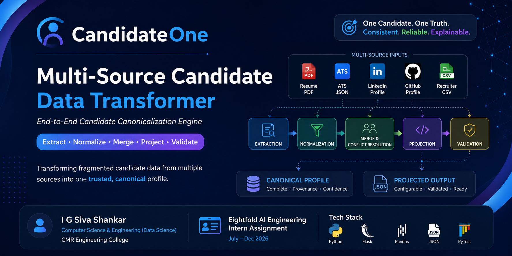

<div align="center">

# 🚀 CandidateOne

### End-to-End Multi-Source Candidate Canonicalization Engine

<p>

Transform fragmented candidate information from multiple sources into a unified, validated, configurable, and confidence-scored canonical candidate profile.

</p>

<br>


<br><br>


</div>

---

# 📌 Overview

CandidateOne is an end-to-end **Multi-Source Candidate Canonicalization Engine** that consolidates fragmented candidate information collected from resumes, ATS exports, LinkedIn profiles, GitHub profiles, and recruiter spreadsheets into a single, trusted canonical profile.

Instead of treating every source independently, CandidateOne follows a deterministic **Extract → Normalize → Merge → Project → Validate** pipeline to produce one unified representation of a candidate.

The project emphasizes:

- Modular software architecture
- Deterministic ETL processing
- Canonical data modeling
- Provenance tracking
- Confidence scoring
- Configurable output projection
- JSON schema validation
- Explainable data transformations

CandidateOne was developed as a solution inspired by the **Eightfold AI Candidate Canonicalization Engineering Challenge**, demonstrating practical software engineering, data engineering, and system design principles.


<p align="center">



</p>

---

# ⭐ Key Highlights

✅ Multi-source candidate ingestion

✅ Resume PDF extraction

✅ ATS JSON extraction

✅ LinkedIn profile extraction

✅ GitHub profile extraction

✅ Recruiter CSV ingestion

✅ Canonical candidate schema

✅ Email, phone, skill and location normalization

✅ Intelligent merge engine

✅ Conflict resolution

✅ Provenance tracking

✅ Confidence scoring

✅ Configurable projection layer

✅ JSON Schema validation

✅ Downloadable canonical & projected JSON

✅ Responsive Flask web application

---

# ⚡ Running the Project

## Prerequisites

| Requirement | Version |
|-------------|----------|
| Python | 3.10+ |
| pip | Latest |
| Git | Latest |

---

## Clone the Repository

```bash
git clone https://github.com/shankar-irla/CandidateOne.git
```

Move into the project directory

```bash
cd CandidateOne
```

---

## Create a Virtual Environment

```bash
python -m venv venv
```

### Windows

```bash
venv\Scripts\activate
```

### Linux / macOS

```bash
source venv/bin/activate
```

---

## Install Dependencies

```bash
pip install -r requirements.txt
```

---

## Run the Application

```bash
python app.py
```

---

## Open in Browser

```
http://127.0.0.1:5000
```

---

## Upload the Following Sample Files

- ✅ Resume (PDF)
- ✅ ATS Export (JSON)
- ✅ LinkedIn Profile (JSON)
- ✅ GitHub Profile (JSON)
- ✅ Recruiter CSV

Click

```
Run CandidateOne Pipeline
```

The application will generate:

- Canonical Candidate Profile
- Projected Candidate Profile
- Confidence Score
- Provenance Information
- Downloadable JSON Files

---
# 🖥️ Application Demo

CandidateOne provides a simple and intuitive web interface for processing candidate information from multiple sources.

The workflow consists of uploading the available candidate documents, executing the ETL pipeline, and reviewing the generated canonical profile.

---
# 🎥 Project Demonstration

Watch the complete CandidateOne workflow below.

https://github.com/shankar-irla/CandidateOne/docs/CandidateOne.mp4

---

## 🏠 Home Page

<p align="center">


</p>

The home page allows users to upload multiple candidate data sources simultaneously.

Supported inputs include:

- 📄 Resume (PDF)
- 📋 ATS Export (JSON)
- 💼 LinkedIn Profile (JSON)
- 🐙 GitHub Profile (JSON)
- 📊 Recruiter CSV

After selecting the available files, the user simply clicks **Run CandidateOne Pipeline** to begin processing.

---

## 📊 Result Dashboard

<p align="center">


</p>

After processing, CandidateOne displays:

- 📈 Pipeline statistics
- 👤 Canonical Candidate Profile
- 📋 Projected Candidate Profile
- 🎯 Overall Confidence Score
- 📝 Provenance Information
- 📥 Downloadable JSON outputs

The dashboard is designed to provide both technical transparency and recruiter-friendly readability.

---

# 🏗️ System Architecture

<p align="center">


</p>

CandidateOne follows a **layered modular architecture**, where every component has a single well-defined responsibility.

The architecture separates:

- Data extraction
- Data normalization
- Candidate merging
- Output projection
- Schema validation

Each module communicates through a fixed canonical schema, allowing the system to remain extensible without affecting downstream components.

### Architectural Benefits

- Modular design
- Easy maintenance
- High testability
- Independent components
- Reusable extractors
- Extensible pipeline
- Deterministic processing

---

# 🔄 End-to-End Pipeline

<p align="center">


</p>

CandidateOne processes every candidate through the following stages:

```text
Resume (PDF)
ATS Export (JSON)
LinkedIn (JSON)
GitHub (JSON)
Recruiter CSV
        │
        ▼
Extraction
        │
        ▼
Normalization
        │
        ▼
Merge Engine
        │
        ▼
Confidence Calculation
        │
        ▼
Projection Layer
        │
        ▼
Schema Validation
        │
        ▼
Canonical Candidate Profile
```

Each stage performs a dedicated responsibility while preserving provenance and ensuring deterministic outputs.

---

# 🎯 Problem Statement

Modern recruitment platforms receive candidate information from multiple independent systems.

A single candidate may exist simultaneously in:

- Applicant Tracking Systems (ATS)
- Resume databases
- Professional networking platforms
- Code hosting platforms
- Recruiter spreadsheets

Since these systems are maintained independently, they often contain conflicting or incomplete information.

Common issues include:

- Multiple spellings of the same name
- Missing contact details
- Duplicate candidate records
- Inconsistent skill names
- Partial employment history
- Conflicting location information
- Different profile completeness levels

Without a canonical representation, these inconsistencies negatively impact:

- Recruiter productivity
- Candidate search accuracy
- AI-based recommendation systems
- Analytics and reporting
- Data quality

---

# 💡 Solution

CandidateOne addresses these challenges through a deterministic ETL pipeline.

Instead of treating every source independently, the system:

1. Extracts candidate information from multiple sources.
2. Normalizes inconsistent data into standard formats.
3. Resolves conflicts using configurable source priorities.
4. Merges all information into a unified canonical profile.
5. Calculates an overall confidence score.
6. Tracks provenance for every extracted field.
7. Validates the final profile using JSON Schema.
8. Generates configurable output representations.

This approach ensures that every downstream system consumes consistent, validated, explainable, and trustworthy candidate data.

---

# ✅ Assignment Requirements Coverage

The project has been developed to address the major objectives of the Candidate Canonicalization Engineering Challenge.

| Requirement | Status |
|-------------|:------:|
| Resume PDF Parsing | ✅ |
| ATS JSON Parsing | ✅ |
| LinkedIn JSON Parsing | ✅ |
| GitHub JSON Parsing | ✅ |
| Recruiter CSV Parsing | ✅ |
| Canonical Candidate Schema | ✅ |
| Data Normalization | ✅ |
| Candidate Merge Engine | ✅ |
| Conflict Resolution | ✅ |
| Confidence Scoring | ✅ |
| Provenance Tracking | ✅ |
| Configurable Projection | ✅ |
| JSON Schema Validation | ✅ |
| Downloadable Output | ✅ |
| Responsive Flask UI | ✅ |

The implementation emphasizes modularity, maintainability, deterministic processing, and extensibility while remaining faithful to the engineering objectives of the assignment.

---
# 📂 Repository Structure

CandidateOne follows a modular, layered architecture where each component has a single responsibility. This organization improves readability, maintainability, extensibility, and testing while enabling seamless integration of new candidate data sources.

```text
CandidateOne/

├── app.py
├── pipeline.py
├── requirements.txt
├── README.md
├── .gitignore
│
├── config/
│
├── docs/
│   ├── Architecture.png
│   ├── Demo_Guide.md
│   ├── Pipeline_Diagram.png
│   └── Technical_Design.pdf
│
├── extractors/
│   ├── __init__.py
│   ├── ats_reader.py
│   ├── base_reader.py
│   ├── csv_reader.py
│   ├── github_reader.py
│   ├── linkedin_reader.py
│   ├── parser.py
│   └── resume_reader.py
│
├── logs/
│   └── candidateone.log
│
├── merger/
│   ├── confidence.py
│   ├── conflict_resolver.py
│   ├── merge_engine.py
│   └── provenance.py
│
├── models/
│   ├── candidate.py
│   └── canonical_schema.py
│
├── normalizer/
│   ├── dates.py
│   ├── email.py
│   ├── location.py
│   ├── phone.py
│   ├── skills.py
│   └── text.py
│
├── output/
│
├── projection/
│   ├── config_loader.py
│   └── output_mapper.py
│
├── sample_input/
│
├── static/
│   ├── css/
│   ├── images/
│   │   └── architecture.png
│   └── js/
│
├── templates/
│
├── tests/
│   ├── sample_data/
│   ├── __init__.py
│   ├── test_extractors.py
│   ├── test_merge.py
│   ├── test_normalizers.py
│   ├── test_projection.py
│   └── test_validation.py
│
├── utils/
│   ├── constants.py
│   ├── exceptions.py
│   ├── helpers.py
│   └── logger.py
│
└── validator/
    ├── config_validator.py
    └── schema_validator.py
```

---

# ⚙️ Technology Stack

CandidateOne combines modern Python libraries with a modular ETL architecture to build a scalable and deterministic candidate canonicalization engine.

| Category | Technology |
|----------|------------|
| Programming Language | Python 3.13 |
| Backend Framework | Flask |
| Frontend | HTML5, CSS3, Bootstrap 5, JavaScript |
| Data Processing | Pandas |
| PDF Parsing | PyPDF2 |
| Email Validation | email-validator |
| Phone Formatting | phonenumbers |
| Country Standardization | pycountry |
| Schema Validation | JSON Schema |
| Logging | Python Logging |
| Testing | Pytest |
| Architecture | Modular ETL Pipeline |

---

# 🏛️ Software Architecture

CandidateOne follows a layered ETL architecture in which every module performs a dedicated responsibility. Each layer communicates using a common canonical schema, ensuring loose coupling and high maintainability.

```text
                    INPUT SOURCES

 Resume      ATS      LinkedIn      GitHub      Recruiter CSV
    │          │          │             │              │
    └──────────┴──────────┴─────────────┴──────────────┘
                           │
                    Extraction Layer
                           │
                    Normalization Layer
                           │
                      Merge Engine
                           │
             Confidence & Provenance
                           │
                    Projection Layer
                           │
                    Schema Validator
                           │
                 Canonical Candidate Profile
```

This layered approach ensures deterministic processing while making the system easy to extend with additional input sources or output formats.

---

# 🧩 Module Responsibilities

## 📥 Extraction Layer

Responsible for reading heterogeneous candidate information from multiple source formats.

Implemented Readers

- Resume Reader (PDF)
- ATS Reader (JSON)
- LinkedIn Reader (JSON)
- GitHub Reader (JSON)
- Recruiter CSV Reader

Each reader transforms its respective source into the internal canonical schema before entering the ETL pipeline.

---

## 🔄 Normalization Layer

Standardizes inconsistent information collected from different sources.

Normalization includes:

- Email validation
- Phone number formatting (E.164)
- Skill normalization
- Date normalization
- Country standardization
- Location cleanup
- General text normalization

---

## 🤝 Merge Layer

Combines multiple candidate profiles into a single trusted representation.

Responsibilities include:

- Conflict resolution
- Source prioritization
- Duplicate removal
- Provenance tracking
- Confidence calculation

---

## 🎯 Projection Layer

Projects the internal canonical schema into configurable output formats suitable for downstream systems.

Capabilities include:

- Field selection
- Field renaming
- Custom output schemas
- Optional provenance
- Optional confidence score

---

## ✅ Validation Layer

Validates the generated candidate profile before it is returned.

Validation checks include:

- Required fields
- Data types
- Nested object validation
- Array validation
- Canonical schema compliance
- Output configuration validation

---

# 🔁 End-to-End Data Flow

```text
Resume
ATS
LinkedIn
GitHub
Recruiter CSV
        │
        ▼
Extraction
        │
        ▼
Canonical Candidate Objects
        │
        ▼
Normalization
        │
        ▼
Merge Engine
        │
        ▼
Confidence & Provenance
        │
        ▼
Projection Layer
        │
        ▼
Schema Validation
        │
        ▼
Canonical Candidate Profile
```

The deterministic workflow ensures that every candidate is processed consistently regardless of the number or combination of available input sources.

---
# 📚 Canonical Candidate Schema

Every extractor converts its source into a common internal representation known as the **Canonical Candidate Schema**.

Using a fixed schema ensures that all downstream components remain independent of the original input format.

```json
{
  "candidate_id": "1001",
  "full_name": "John Doe",
  "emails": [],
  "phones": [],
  "location": {
    "city": "",
    "region": "",
    "country": ""
  },
  "links": {
    "linkedin": "",
    "github": "",
    "portfolio": ""
  },
  "headline": "",
  "years_experience": 0,
  "skills": [],
  "experience": [],
  "education": [],
  "provenance": {},
  "overall_confidence": 0.0
}
```

The canonical schema serves as the single source of truth throughout the pipeline.

---

# 🎯 Projection Layer

CandidateOne separates **internal representation** from **external output** through a configurable projection layer.

Instead of modifying the canonical schema, users can customize the generated output using configuration files.

Example:

```json
{
  "fields": [
    {
      "path": "full_name",
      "rename": "candidate_name"
    },
    {
      "path": "emails[0]",
      "rename": "primary_email"
    }
  ]
}
```

Supported capabilities include:

- Include selected fields
- Rename output fields
- Hide provenance information
- Hide confidence scores
- Apply output formatting
- Generate custom JSON structures

This makes CandidateOne adaptable to different downstream systems without changing the ETL pipeline.

---

# ✅ Schema Validation

Before any candidate profile is returned, CandidateOne validates the generated output against the canonical JSON schema.

Validation includes:

- Required field verification
- Data type validation
- Nested object validation
- Array validation
- Configuration validation
- Confidence score validation
- Canonical schema compliance

Only valid candidate profiles are exported.

---

# 📈 Confidence Scoring

Every generated candidate profile receives an overall confidence score.

The score combines:

```text
Source Reliability
        +
Profile Completeness
        +
Successful Validation
```

### Default Source Reliability

| Source | Weight |
|----------|--------|
| Resume | 0.30 |
| LinkedIn | 0.25 |
| ATS | 0.20 |
| GitHub | 0.15 |
| Recruiter CSV | 0.10 |

The confidence score provides downstream systems with an indication of the overall reliability and completeness of the generated profile.

---

# 📁 Sample Input

CandidateOne supports the following input sources:

| Source | Format |
|---------|--------|
| Resume | PDF |
| ATS Export | JSON |
| LinkedIn Profile | JSON |
| GitHub Profile | JSON |
| Recruiter CSV | CSV |

Example directory:

```text
sample_input/

├── resume.pdf
├── ats.json
├── linkedin.json
├── github.json
└── recruiter.csv
```

---

# 📤 Generated Output

CandidateOne generates two JSON files:

- **Canonical Candidate Profile**
- **Projected Candidate Profile**

Example:

```json
{
  "candidate_id": "1001",
  "full_name": "Irla Ganga Siva Shankar",
  "emails": [
    "example@email.com"
  ],
  "phones": [
    "+919876543210"
  ],
  "skills": [
    "Python",
    "Flask",
    "Machine Learning"
  ]
}
```

The generated files are stored inside the `output/` directory and can also be downloaded directly from the web application.

---

# 🧪 Testing

CandidateOne includes automated tests for major pipeline components.

Run all tests:

```bash
pytest
```

Run a specific test module:

```bash
pytest tests/test_merge.py
```

Covered modules include:

- Extractors
- Normalizers
- Merge Engine
- Projection Layer
- Validation Layer

---

# ⚡ Performance

Current implementation supports:

| Component | Status |
|-----------|--------|
| Resume Parsing | ✅ |
| ATS Parsing | ✅ |
| LinkedIn Parsing | ✅ |
| GitHub Parsing | ✅ |
| Recruiter CSV Parsing | ✅ |
| Merge Engine | ✅ |
| Projection Layer | ✅ |
| Schema Validation | ✅ |
| Confidence Scoring | ✅ |
| Provenance Tracking | ✅ |

The architecture is designed to process large batches of candidate profiles efficiently while maintaining deterministic results.

---

# 🛡️ Edge Cases Handled

CandidateOne safely handles numerous real-world scenarios, including:

- Missing email addresses
- Missing phone numbers
- Duplicate candidate sources
- Duplicate skills
- Invalid email formats
- Invalid phone numbers
- Missing education records
- Missing work experience
- Partial candidate profiles
- Unknown JSON fields
- Empty recruiter rows
- Null values
- Incomplete location information

Whenever possible, the pipeline produces a valid canonical profile instead of failing.

---

# 🎯 Design Principles

CandidateOne was built following core software engineering principles:

- Modular architecture
- Single Responsibility Principle (SRP)
- Separation of concerns
- Configurable output generation
- Deterministic processing
- Explainable merge logic
- Extensible ETL pipeline
- Reusable components
- Maintainable codebase

These principles make the project easy to extend with new data sources and output formats.

---

# 🚀 Future Enhancements

Potential improvements include:

- OCR support for scanned resumes
- DOCX resume extraction
- AI-powered skill extraction
- Large Language Model (LLM) integration
- Candidate similarity search
- Candidate ranking engine
- REST API support
- Docker deployment
- Kubernetes orchestration
- PostgreSQL persistence
- Elasticsearch indexing
- Real-time pipeline monitoring
- Cloud deployment (AWS / Azure / GCP)

---

# 👨‍💻 About the Developer

## I G Siva Shankar

**B.Tech – Computer Science & Engineering (Data Science)**

CMR Engineering College, Hyderabad

### Areas of Interest

- Artificial Intelligence
- Machine Learning
- Data Engineering
- Backend Development
- System Design
- Agentic AI

---

# 🤝 Connect

<p align="center">

<a href="https://github.com/shankar_irla">

</a>

<a href="https://linkedin.com/in/shankar_irla">

</a>

<a href="mailto:238r1a6786@gmail.com">

</a>

</p>

---

# Acknowledgements

This project was developed as part of the **Eightfold AI Candidate Canonicalization Engineering Challenge** to demonstrate practical software engineering, data engineering, and ETL pipeline design principles.

---

<div align="center">

# ⭐ Thank You!

### CandidateOne

**End-to-End Multi-Source Candidate Canonicalization Engine**

Built with ❤️ by **I G Siva Shankar**

</div>